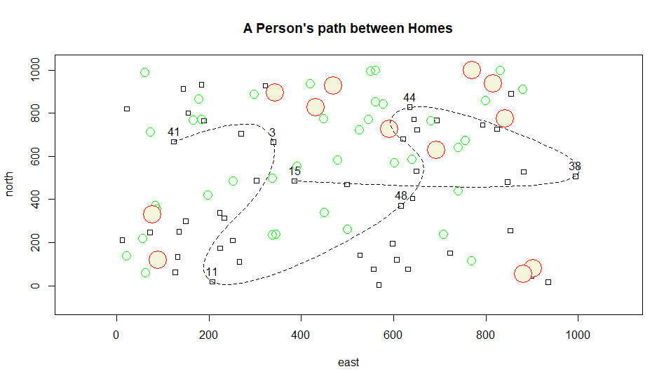

# Creating and Plotting Objects
### Plot

### Description
The plot above displays a person's path between many different homes; each home is given a ID number to make them distinguishable. Small trees are also displayed in this map as green circles, while large trees are displayed as larger red circles. The path above shows that the person passed 7 different homes in reaching it's destination in a parabolic manner. 
