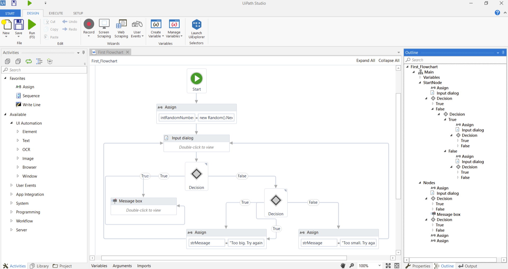

# Integrating Data Science with Robotic Process Automation

Data science offers a wide range of possibilities in improving numerous career fields from environmental sciences, engineering, and business applications. As our labor operations shift toward the technological side, most tasks can be perceived as tedious when assessing its efficiency from a macro perspective. One big phenomenon, to eliminate this repetition; is the implementation of **Robotic Process Automation (RPA)** in technological processes. RPA is an automation software that utilizes software robots to execute any process to remove the unnecessary repetition. **UiPath** is the lead programming software that provides business users an intuitive platform to utilize RPA to aid their operations. 

From a financial business standpoint, RPA can be utilized to automate manual tasks in the office and deal with customer service. For example, RPA can detect errors, like file formats, in online confidential documentation. By handling this problem before it becomes an issue reduces operational calls in the customer service department. However, if it does fall into there, RPA is able to handle customer service operations utilizing past data from clients. By automating these operations, businesses and firms can find more efficient ways in utilizing labor to self-improve. 

 

Although it isn’t exactly new as to how RPA aids business processes, it is still capable of reaching areas that affect the health of many. Healthcare providers can utilize RPA to find faster and more efficient outcomes to financially satisfy their customers. Especially when transferring old data to new systems, RPA is solely based on automating the process of transferring mass amounts of data to ensure that every patient isn’t left behind. By ensuring both efficiency and accuracy, RPA proves to be a great tool when it comes to handling, accessing, and utilizing data. 

### Cited Sources

What is RPA: Robotic Process Automation Software. (n.d.). Retrieved September 11, 2020, from https://www.automationanywhere.com/rpa/robotic-process-automation

RPA Healthcare: Healthcare Automation Solutions. (n.d.). Retrieved September 11, 2020, from https://www.automationanywhere.com/solutions/healthcare