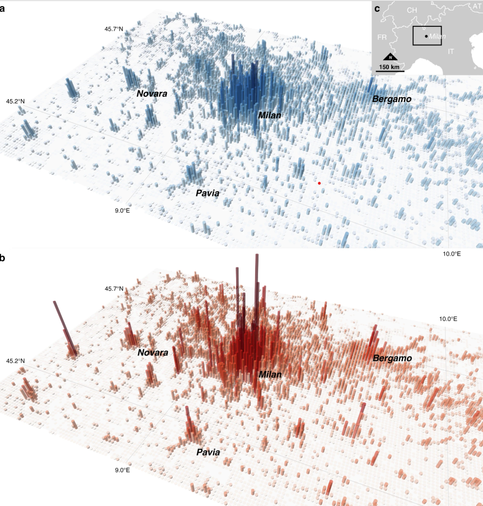

# Utilizing Data Fusion to Assess the Changes in Europe's Population Density

Population group data is an integral aspect in legislating policies, disaster risk management, and planning infrastructure for a city. Throughout the past couple of centuries, advancements in the recording of this data has evolved from censuses to the development of data science. From a macro-perspective, we have certainly improved in this manner, but there are still lapses that this data fails to reflect. These problems can range from students living on campus for a semester, suburban citizens working in urban cities, and incoming tourists throughout the seasons. To help mitigate this problem, one group of European data scientists decided to use a "**multi-layered dasymetric mapping approach**" that combines statistics and geospatial data to further classify these populations and help analyze the population's behavior. 

To further define **multi-layered dasymetric mapping**, it is important to understand the two parts in this method: **multi-layered** and **dasymetric mapping**. Dasymetric mapping has been previously used in the early 20th century to improve the geographical representation of population groups. Because not every human lived in a common geographic area, dasymetric mapping by separating the population counts into common land-use/land-cover (LULC) areas. These characteristics include different infrastructure and roads. By applying dasymetric mapping to data science today, population grids could now implement this data by creating spatial resolution for mapping and plots. 

The multi-layered aspect of this approach further dives into the dividing of different population groups. However, these researchers wanted to acknowledge the behavior of professions and activities, rather than the already known geographical characteristics. As a result, the researchers uses geospatial data to help disaggregate the population into different professions (ie. residents, workers, students, and tourists). Combining these two concepts led to the creation of a population grid that captures population group behavior at 1km-squared.

    

To help display this approach, the group decided to use 3-D bar plots to display Milan, Italy using the multi-layered dasymetric mapping approach. The height and transparency of the bars are proportional to the estimated population of that population grid.  In response to the concern of population during daytime and nighttime, they provided two graphs and displayed the higher concentration in Milan during the day (a) and a higher variability during the night (b). This ultimately verifies the variation between populations around big cities during these two periods using the multi-layered dasymetric approach. 

The researcher's journal article displays even more visualizations on how they utilized their approach to reach many different conclusions. Furthermore, it addresses the alternatives that this approach might be compared to and why it isn't considered by displaying its numerous calculations to validate their data. Ultimately, improving how we understand population group data is critical in reaching many decisions. With the development of data science and dasymetric mapping, every human can accurately be accounted for when making the decisions that matter for everyone. 

