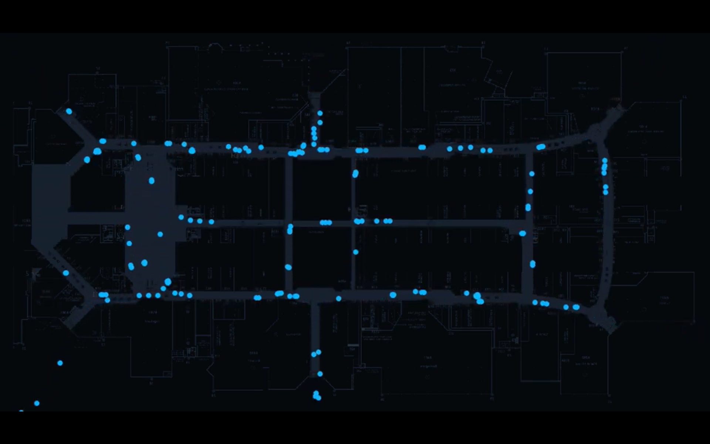

# How Pathr is Capitalizing in Spatial Intelligence

George Shaw is the founder and CEO of his spatial modeling business, **Pathr**. George’s passion for spatial modeling originated from his previous experience with Second Spectrum. Second Spectrum provided spatial modeling and analytics for teams in the NBA, Premier League, and MLS to help optimize production in critical situations. Instead of focusing on the sports industry, George wanted to provide spatial modeling on building layouts to help improve employee movements and interactions. 

The increase in demand for Pathr comes from the necessity of implementing social distancing in a workplace/retail environment. As a result, Pathr uses Unity, a real-time 3D development platform, to construct modeled layouts for their clients. However, Pathr’s unique value proposition comes from their ability to provide simulations to replicate human behavior, throughout their client’s layout, to understand what guidelines must be put to ensure security. Furthermore, Pathr uses existing surveillance cameras, machine signaling and card swipes to gather data and display simulated movements.

*Example of Pathr's simulation feature, using a mall-like enviornment, provided to clients*

To accurately predict the behavior of customers and employees, an immense amount of simulations must be executed and stored. Luckily, Unity Simulation provides Pathr a cloud service that runs a series of parametrized Unity builds. Once Pathr can construct these layouts and execute a simulation, they are able to let Unity Simulation run the backend data collection to provide customers their data faster. The efficiency in collecting data has been an ever-going collaboration between Pathr and Unity in finding ways to speed up simulations and help more and more clients. 

Although it might seem that this will only be used as a short-term solution for COVID, Pathr plans on targeting general contracting companies to help enhance floor layouts. Spatial intelligence could not only work in office spaces, but be implemented to retail stores, malls, and even festivals. The potential of human simulations is enlightening, and George believes that over time it’ll only become more and more realistic.  

 

Source: https://www.engineering.com/DesignSoftware/DesignSoftwareArticles/ArticleID/20706/How-Spatial-Intelligence-is-Improving-Our-Environments.aspx