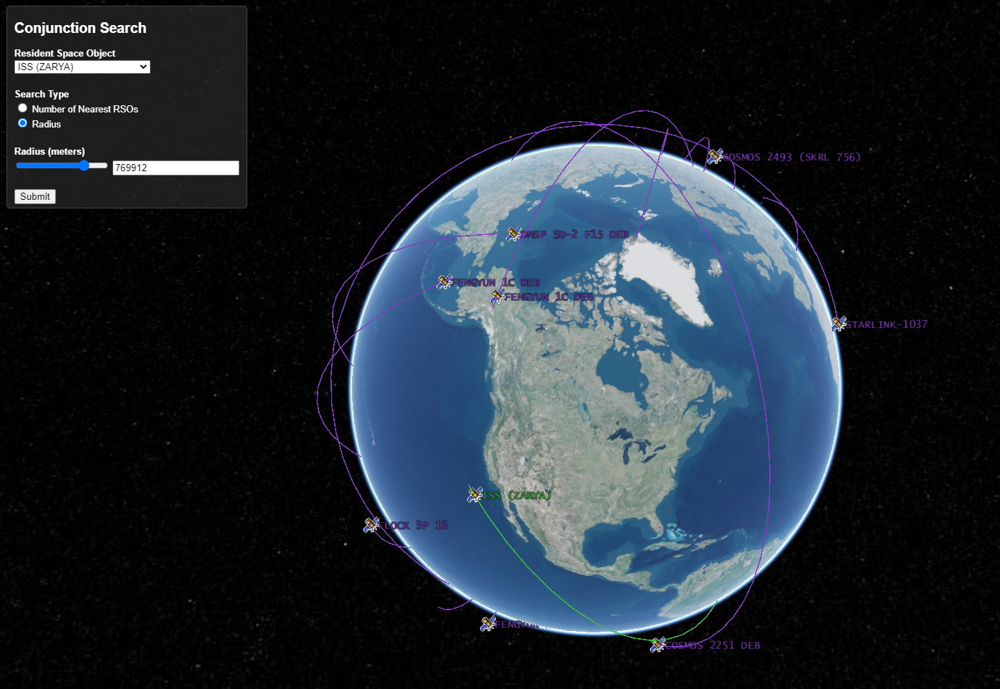
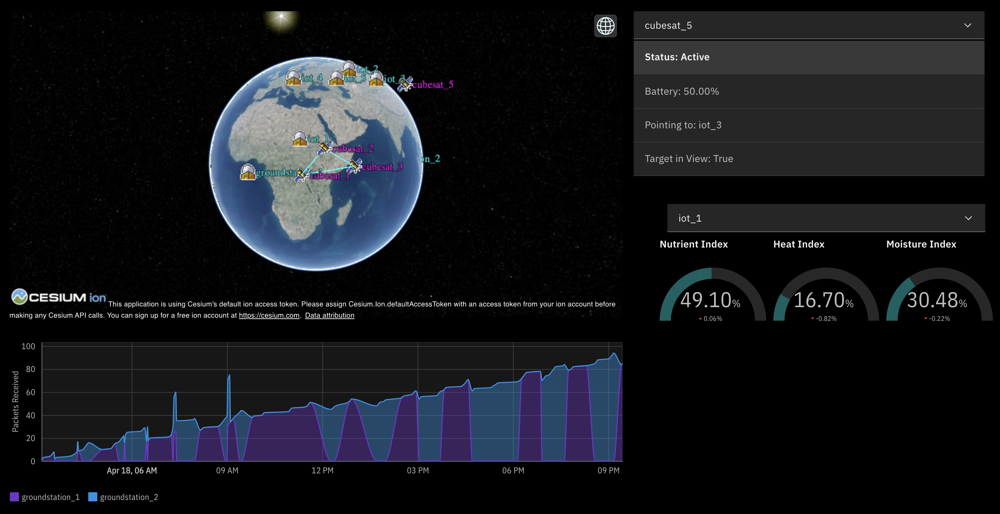

# How IBM is Entering the Space Race Using Open Source Technology

International Business Machines (IBM) Corporation has entered the Space Race by announcing the commencement of one project that helps project the paths of anthropogenic space objects (ASO). These objects are human space debris, like specks of paint or old satellites, that travel at "speeds around 8,000 meters per second". This poses a huge threat to existing satellites that are being used to ensure they are protected. In order to safely dodge these projectiles, "orbit projection" is essential in understanding the movement of debris and existing satellites while in the atmosphere. 

*This is an image of IBM's Space Situational Awareness Project that displays various orbit projections*

IBM's Space Situational Awareness Project utilizes machine learning to create physic-based models to develop these orbit projections. As an indicator for ASO, IBM is using data from the United States Strategic Command that provides parameters for the location of ASO. Behind this model, a second model is used to verify the accuracy of these projections using XGBoost. The main goal of this program is to create tree regression models, using a gradient boosting library, that tries to minimize errors through each tree. As a baseline, it uses data from USSTRATCOM and measures the errors between the two models. 

*This is an image of the KubeSat project that provides the guidance and operations of client's satellites*

The introduction of these models helps promote a safer and more reliable place for industries entering the space industry. As a result, "satellite swarms" is gaining popularity because they are much smaller and cheaper than regular satellites. For example, Amazon sent 3,236 satellites to boost connectivity in places around the world that aren't able to access connection. To support these swarms, IBM's KubeSat project aims to help guide these swarms and execute their specific tasks. By providing the operator role to these satellite swarms, companies will now have a pathway into entering the space industry with the aid of IBM. 

Source: https://siliconangle.com/2020/10/01/ibm-sends-open-source-space-technology-orbit/

