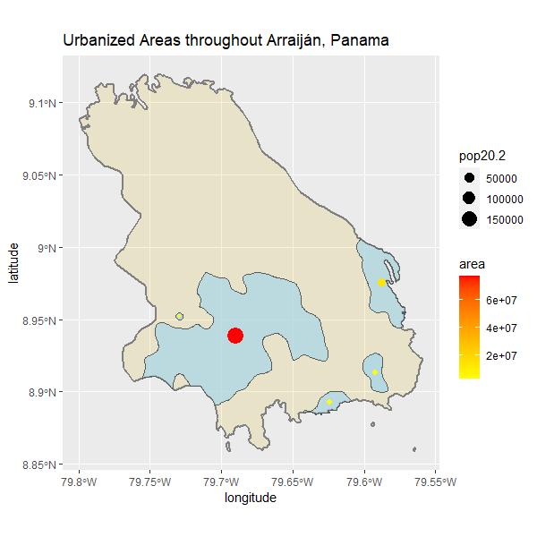
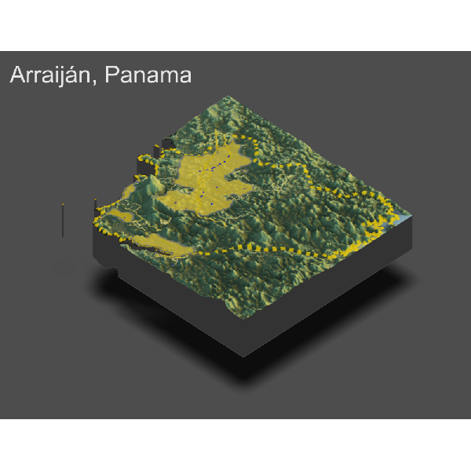

# Final Project: Panama's Population Distribution

### Accessibility 1:  

### Description: 

The geospatial plot above describes the urban areas within Arraijan, Panama using the areas and population of these areas. Based on this plot, there are five major urban areas with the larger area being represented with the larger, red circle. It is also very interesting that these urban areas are in the south side of the providence. 

### Accessibility 2: 

### Description:

The total number of people residing in these five urban areas is 214,654. The area and population between these 5 urban areas is very skewed; four out of the five urban areas are fairly small in area and population, relative to the red circle where most of the population and area is located. Although the roadways are a little scattered, The primary roadways run through the more populous urban areas, while the secondary and tertiary roadways connects these areas because of the mountainous terrain. The health care centers in Arraijan, Panama are mainly located within the urban areas and along the roadways. The majority of the health care centers is within the main urban area while two of the urban areas does not have a close health care center. This could prove to be a problem for the rural people looking for nearby health centers in critical situations. 

### Accessibility 3: 

### Description: 

This topographic plot of Arraijan, Panama shows that the urban areas are separated by the mountainous terrains and established in flatter areas. Similar to the establishment of urban areas, most of the roadways are in the flatter areas, while the secondary and tertiary roadways are through the mountainous terrain to connect the urban areas. Furthermore, the health care centers are also only located in the urban areas, where it is flatter. My initial interpretation of these urban areas was that there were jungles that separated these urban areas. However, I was surprised to see that the mountainous terrains are what separates these urban areas. 