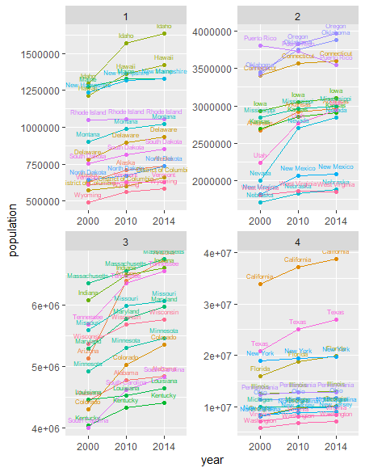

# Project 1.2:  Application Program Interfaces (API) & Tidying up your Data

### Plot

### Description

 The plot above displays the population data, extracted from the United States Census Bureau website, of 52 states and territories from 2000, 2010, and 2014. To avoid the cluster of data, the plot is split into 4 sections that is based on the quantile the population data falls in compared to the rest. Generally speaking, the data shows a general increase, from all states and territories , from 2000 to 2014. However, it is important to note that Rhode Island, in quantile 1, is steadily consistent throughout 2000 to 2014. Furthermore, Puerto Rico, located in quantile 2, steadily decreases throughout 2000 to 2014. One possible cause, of this outlier, could be the increase of emigration from Puerto Rico to the United States or other first-world countries. 