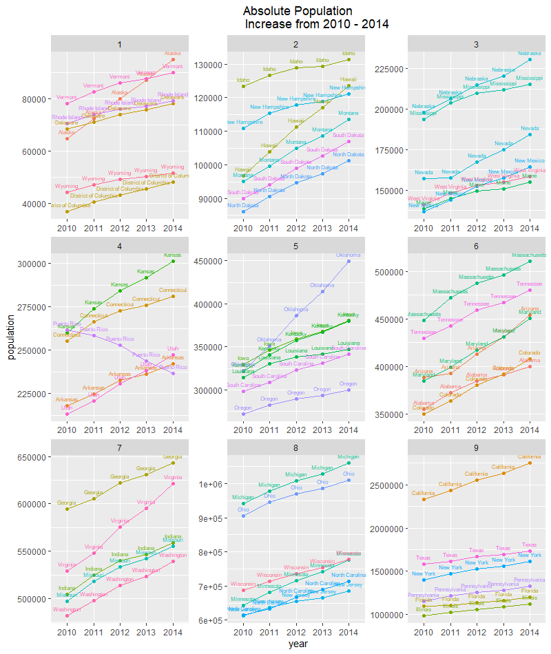
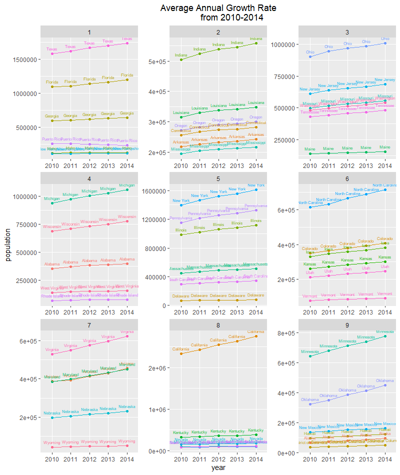

# Project 2.1: Independently Accessing an API and Creating your Own Plots

### Plot #1

### Description

The plot above is utilizes data from the United States Census Bureau to display the absolute increase in population from 2010 to 2014 for all 50 states, including D.C. and Puerto Rico. The states are separated into 9 quantiles to prevent the cluster of line plots; they are ordered from the lower quantiles to higher quantiles. Despite its separation through quantiles, California is shown to have the highest increase in absolute population, while Nebraska has the lowest overall population throughout the 5 years. 

### Description 

The plot above asseses the population growth rate of all 50 states, including D.C. and Puerto Rico. Much like the previous plot, this plot separates the sample into nine quantiles. However, this plot is not as volatile as the previous plot, because growth rate does not fluctuate as extreme as population numbers. Nevertheless, the increase in population growth rate is still evident in the urban states: Texas, Florida, California, New York, etc. 