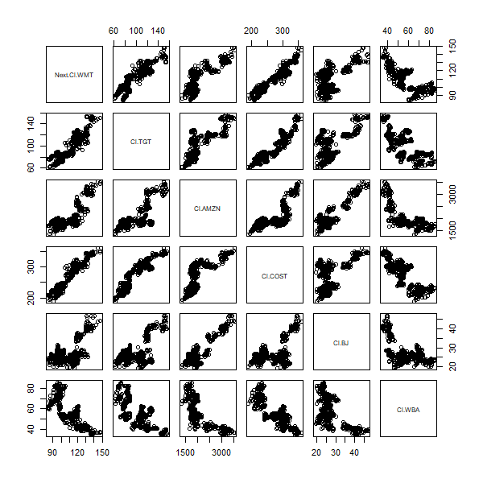
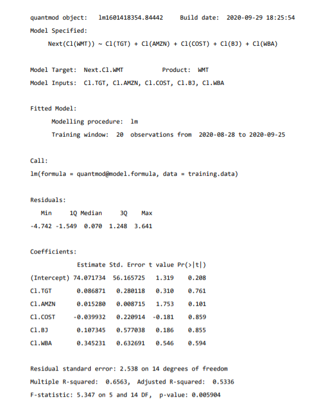

# Project 2.2: Using the Stock Market to Describe, Analyze, and Predict 

### Correlation Matrix

### Description

The correlation matrix above predicts the behavior of Walmart's stock value. To provide a better prediction, I decided to use five predictor stocks that competes in the similar industry to Walmart: Target, Amazon, Costco, BJ's, and Walgreens. The overall trend of these graphs displays a positive correlation with Walmart. However, Walgreens goes against this trend by decreasing in value, while Walmart increases. 

### Statistical Summary 

### Description

To further investigate the statistical characteristics of the correlation matrix, a summary is provided above. One important value to recognize is that R-squared is equal to 0.6563. This shows that the data possesses a form of variablilty that can be slightly concerning. To further investigate this variablilty, the residuals are provided as well. Although the median stays close to zero, the data has a minimum residual of -4.742 and a maximum 3.641 and could explain why R-squared is not closer to 1. 

