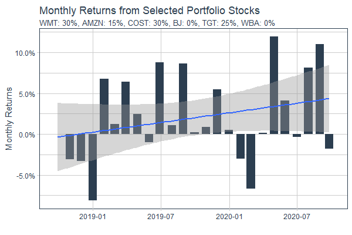
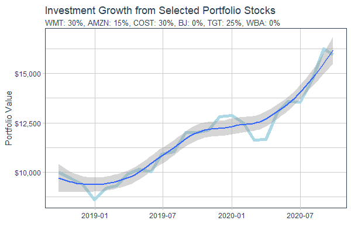

# Project 2.3: Using Tidyquant to Analyze Stock Performance 

### Plot #1

### Description

The plot above comes from my personal portfolio of stocks, also mentioned in project 2.2, and asseses their monthly returns throughout the past 25 months. One thing to note is that despite the negative monthly return percentages in the end of 2018 and the beginning of 2020, the overall trend is a general increase in monthly returns. 

### Plot #2

### Description

The plot above assesses the investment growth, with the initial investment at $10,000, throughout the past 25 months. One of the main reasons as to how I achieved this growth was due to the alarming behavior of Walgreens. Walgreens was shown to have a negative correlation with Walmart and its other competitors. I decideded that if a percentage of my investment were to go to Walgreens, it would ultimately hurt my investment growth. This is why i devoted the majority of my portfolio to safer options like Walmart, Costco, and Target because they provided stable and cost-efficient options in investment growth. 