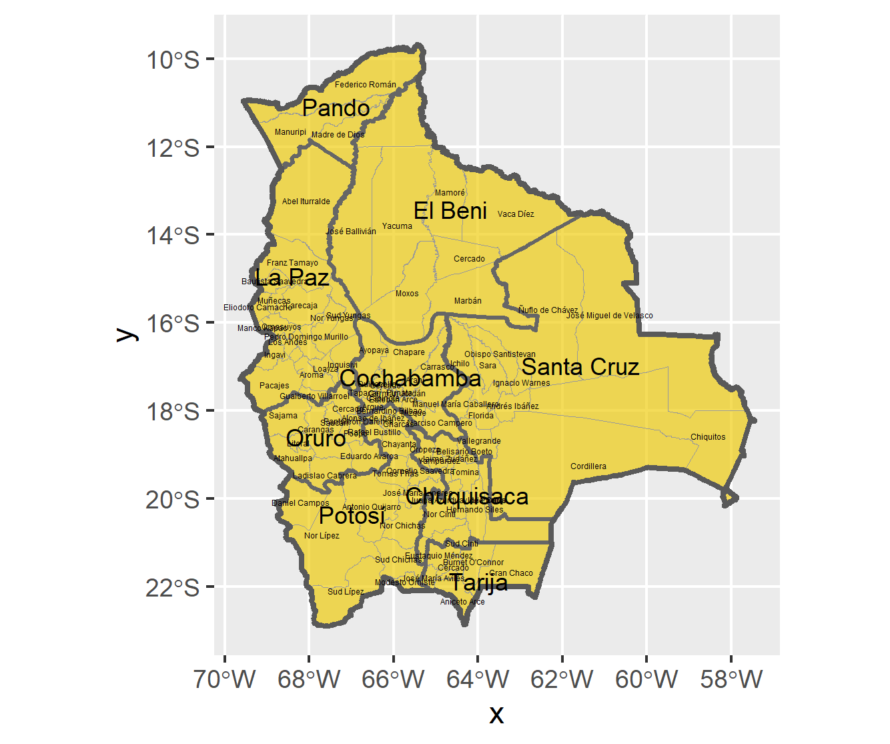

# Projecting, Plotting and Labelling Administrative Subdivisions

### Plot

### Description

The image above displays a spatial plot of Bolivia which was gathered by a database called GADM. Within this database, three different shapefiles are provided for each country which contains the country, departments, and cities. Most of the cities are located in Cochabamba, however, the capital is located in the department of Santa Cruz. 