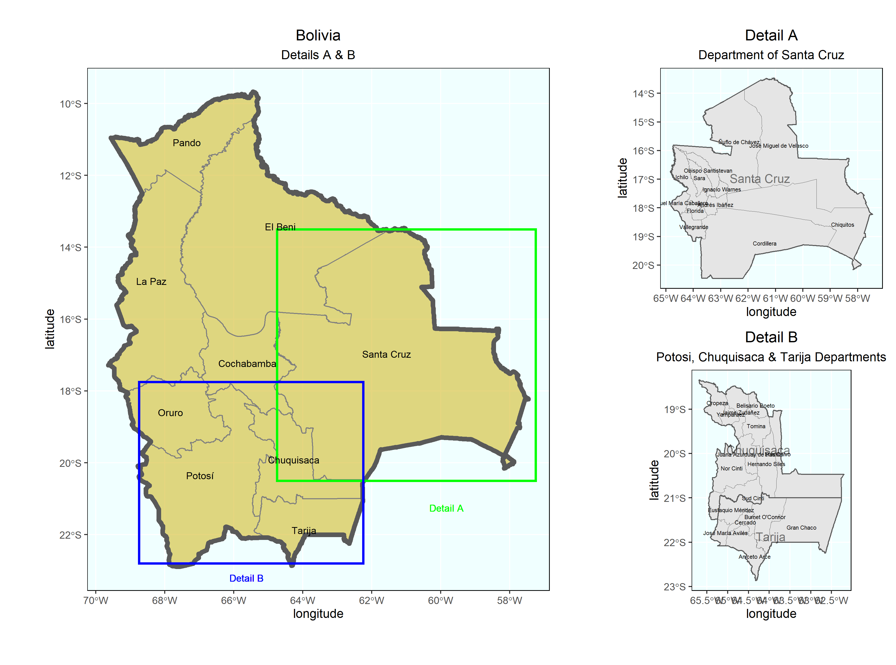

# Project 3.2: Projecting, Plotting and Labelling Administrative Subdivisions - Stretch Goals

### Plot

### Description

The plots above displays the map of Bolivia using spatial data from the GADM website. Along with this plot, two detail plots, Detail A and Detail B, were also plotted and highlighted on the initial Bolivia plot. Detail A shows the most populous department, Santa Cruz, and is disaggregated into further subdivisions. Detail B conjuncts Potosi, Chuquisaca, and Tarija to display the smaller departments of Bolivia.  