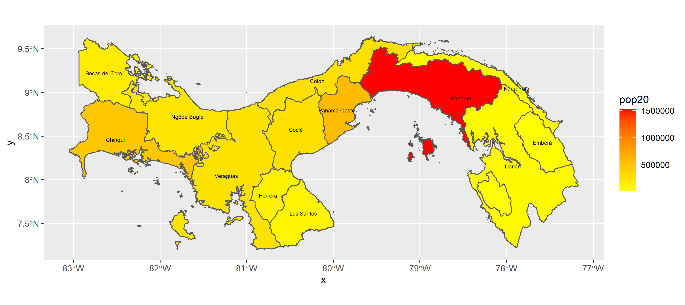

# Project 4.1: Extracting Populations from a Raster and Aggregating to each Unit

### Deliverable Plot: 

### Description: 

This gradient filled geospatial plot displays the concentration in population for the provinces in Panama. The gradient is explained by the legend shown to the right with a heat scale to describe the concentration. Based on the plot, the greater percentage of the population lives in the province of Panama. On the other hand, the lighter concentrations in population resort to the east of the high populated province with places like Darien, Embera, and Kuna Yala. 

### Stretch Goal 2 Plot: 

### Description: 

This second plot displays the log of the population of people in Panama, but further into sub-provinces to locate specific places. Once again, the most densely populated area is Panama, which includes their national capital: Panama City. Although the eastern side was shown to have less density in previous plot, Sambu is the outlier that skews the display of that data by having a lighter yellow color, compared to the places around it. 

### Stretch Goal 3 Movie:

### Description: 

This movie provides a more visualized representation of the population densities around Panama. Based on this plot, Panama and Changuinola are more taller than the other sub-provinces to show their higher in densities. On the eastern side of Panama, Sambu is relatively smaller than all the other provinces around it to emphasize its lack in population density. Upon further research, this is because the city is not as economically developed. Instead, their population comes from occasional recreational activities along their vast rivers and jungles. 