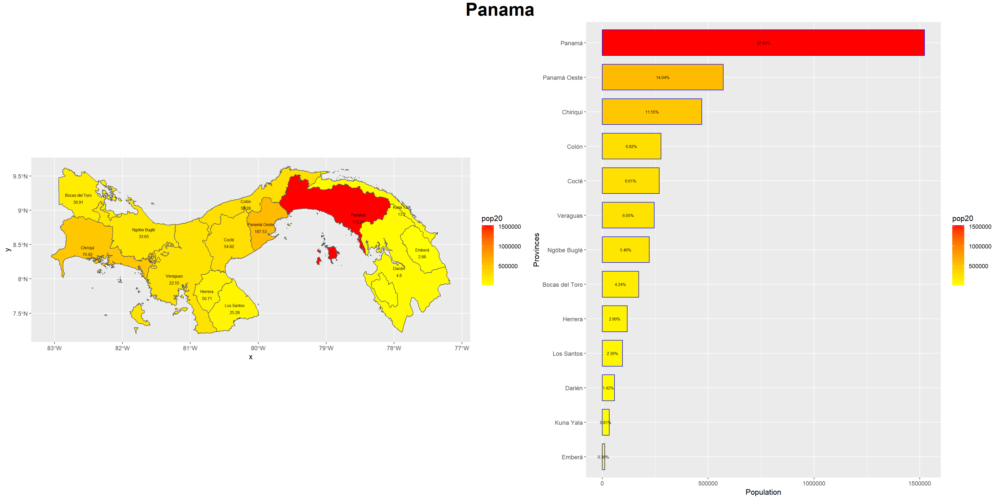
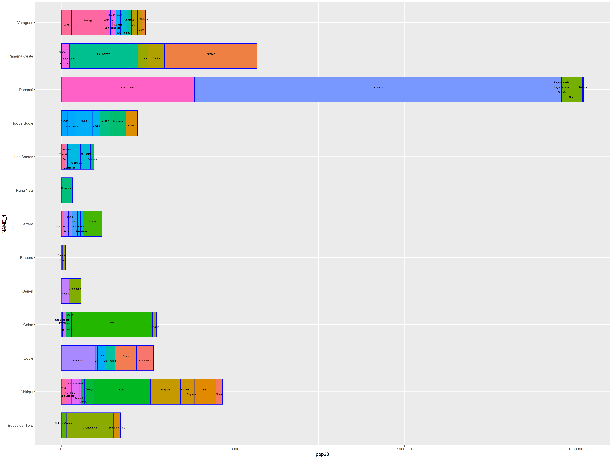

# Project 4.2: Creating a Geometric Bar Plot with your Simple Feature Object

### Deliverable Plot: S

### Description: 

The plot above quantifies the density of the provinces of Panama and displays a bar graph to order the provinces based on their population. As expected, the highest population resides in the province of Panama. On the other hand, the lower population is in Embera with it possessing only 0.30% of the total population. 

### Stretch Goal Plot: 

### Description: 

This bar plot is similar to the previous plot, but is broken down into sub-provinces to display the distribution of the population within the provinces. Although Panama was the most populous provinces, there are sub-provinces within Panama that are extremely low like Chepo. Another province that has a similar behavior as Panama is Colon, where majority of its population resides in the sub-province of Colon. 