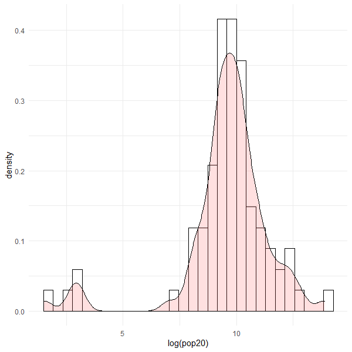
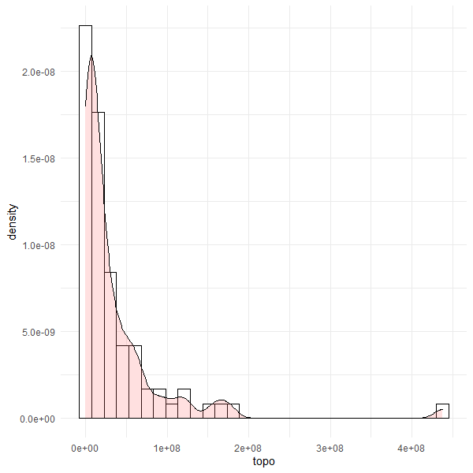

# Project 5.1: Extracting Land Use and Land Cover Data for Description 

### Population Plot: 

### Description: 

The histogram above shows that majority of subdivisions has a log(population) of 10 in Panama. This unimodal shape, however, is skewed to the left and has a gap between 4 and 6. The skewed subdivisions must be rural areas in Panama because they are less populous than the larger cities like Panama City. 

### Topography Plot: 

### Description: 

The histogram above shows that the majority of the subdivisions are within the lower bin of the topography, lower elevations. The one outlier shown above is the subdivision of Changuinola. This subdivision is known to be at a higher elevation because it borders Costa Rica. Other than Cahnguinola, the other subdivisions are all relatively in the same elevation. 